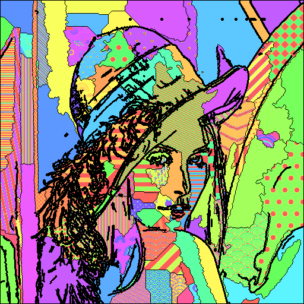

# *Romerizator*

Os programas nesta pasta implementam um algoritmo para converter fotos em símiles do estilo de um artista brasileiro conhecido pelo resultado considerado... pouco artístico... por pessoas que compreendem um pouco mais a respeito do assunto. Seu estilo é caracterizado pela presença de contornos fortes em preto, que dividem a imagem em regiões preenchidas com padrões coloridos.

As rotinas aqui carregam uma imagem, detectam e reforçam sua borda, definem as regiões e as preenche com padrões coloridos formados a partir de imagens de texturas. Os códigos estão escritos em Python 3.8, e necessitam das bibliotecas *NumPy*, *OpenCV* e *Pillow*. Os arquivos disponibilizados aqui são o seguinte:

* `romerizator.ipynb`: *notebook* a ser utilizado com o [Jupyter](https://jupyter.org/). As rotinas no *notebook* realizam a transformação em apenas uma única imagem, mas contém comentários detalhados a respeito de como o processamento é feito. Para rodá-lo, baixe o arquivo, faça as modificações que achar necessárias, e mande executar. Você precisa passar o nome do arquivo a ser processado, e o nome do arquivo que conterá a imagem resultante.
* `romerizator.py`: *script* em Python que carrega as imagens em formato `.png` de um diretório chamado `imagens`, processa cada uma delas, e salva os respectivos resultados (com o mesmo nome) em um diretório chamado `romerizadas`.
* `texturas`: este diretório contém várias imagens em formato `.png` que são utilizadas pelos programas para gerar os padrões que preencherão as regiões descobertas na imagem. Essa imagens são *necessárias* para o funcionamento dos programas acima, então é necessário clonar esse diretório também. Ele deve ser colocado na mesma pasta que os programas.
* `lena.png`: imagem tradicional colorida *Lena*, usada como exemplo.
* `romerized.png`: resultado da *romerização* da *Lena*.

Segue o resultado da aplicação do algoritmo em uma imagem:

